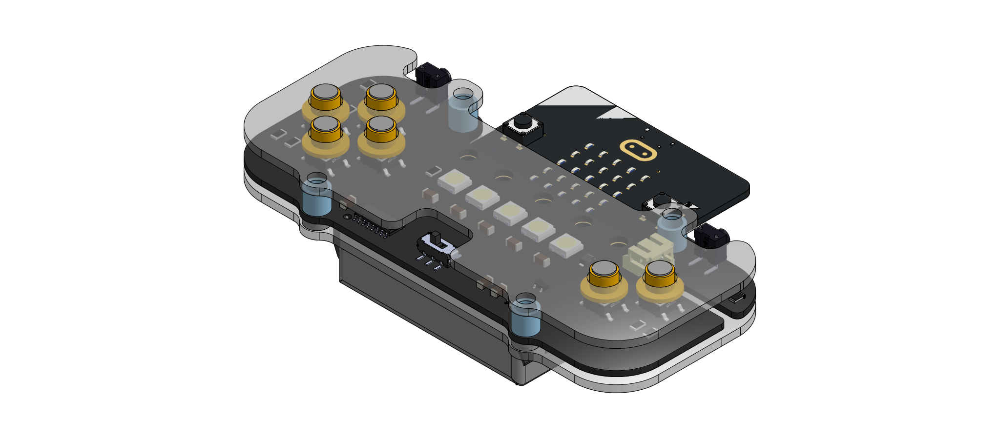

# Electronics enclosure design walk-through with Onshape

## Workshop activity

In this workshop, we’ll be demonstrating how to use computer-aided design (CAD) tools to design enclosures for electronics.
In Onshape, we’ve started designing a laser-cut enclosure for the solder:bit Gamepad with 3D printed spacers and button caps. You are given the task to design the rest of the enclosure insert and position the parts in the assembly to make sure everything fits.

### 1. Create a free onshape account
Go to [onshape.com](https://www.onshape.com/en/) to create an account  this can be a student account that gives you unlimited private designs, or an account for makers where all your designs are public.

### 2.	Create a personal copy of the workspace 
Copy this [workspace](https://cad.onshape.com/documents/03e360eab7c280aec5a0fc8e/w/88428d9209ae85e1daa35f17/e/1467ba0b7f908cfe4e9b5ae8?renderMode=0&uiState=687371614301f30186208088) to your own account from the hamburger menu in the top right. Take a look at all the design files in the bottom tabs containing part studios and assemblies. The Case Assembly tab is where we will mostly be working from. We’ve inserted a 3D model of the PCB from KiCAD into this assembly and started designing parts around it 

Importing from KiCAD

We've done this bit for you and have imported the board to start the design. However, if you're interested in doing this yourself, in KiCAD, from the PCB Editor, go to File > Export > STEP / GLB ... , and select STEP as the format. You may need to set the board outline tolerance to "standard (0.01 mm) for it to recognise the boundary

### 3.	Understand the bottom panel design
Enter the Acrylic Case part studio. Here, within the context of the main Case Assembly, we’ve designed the bottom panel of the solder:bit case. In the left panel’s feature list, you can see the operations needed to make the back panel: we defined a plane below the bottom surface, we sketched out the outline of the panel,  then we extruded it to make it 3D. you can double click on any of these features to see how they were performed, or even change them. Your job is to replicate these steps for the top panel.

### 4.	Create a new plane
Using the Plane tool, create an offset plane 6mm from the top surface the PCB.

### 5.	Start a sketch
On the plane we just created, start a sketch. Copy features from the PCB with the Use tool. Specifically, the outline, the 4  4mm mounting holes.

### 6.	Close the cutout for the battery
Using the Line and Trim tool, fill in the cutout made for the battery cable.

### 7.	Create cut-outs for the buttons
With the Use tool, project the button positions into the sketch, then Create 6x 7mm circles on each of these positions for the button cut-outs

### 8.	Create cutouts for the L and R buttons and the power switch.
After projecting features of the L and R buttons and power switch into the sketch, draw lines and rectangles make cutouts for these. you can use the dimensioning tools and constraints to make sure they are where you want them.

### 9.	Clean up the edges and give the cut-outs a 3mm fillet.
With the Trim tool remove any extra edges that create bounded regions that we don't want to extrude. Then use the fillet tool to round off any corners with a 3mm fillet.

### 10.	Extrude the sketch
Complete the sketch with the green tick, and using the extrude tool, extrude the sketched region by 2mm

### 11.	Insert the top panel into the assembly
Go back to the assembly and use the insert tool to place the top panel into the assembly. If you don’t specify a position it will automatically place itself in the position it was in the design context. Click the green tick to confirm. To constrain the part and keep it from moving when you drag it, use the group tool to group it with the already fixed bottom panel.

## Stretch Activities

### **Easy**: Placing button caps
If you have finished designing the top panel, consider placing button caps in the assembly. We've already designed these for you in the Button part studio. Use the Insert tool in the Case Assembly to locate the buttons and place them. Insert the buttons "as rigid" so that they remain combined when moving them about, and use the "Fastened mate" to fix them to the positions in the cut-outs.

###  **Medium**: Place screws and nuts
In the Assembly tab, use the Insert tool to insert parts from "Standard Context". Find an M4 x 16 Socket head screw and an M4 nut to got with it and place it in the assembly.

### **Hard**: Design your own button caps
Have a go at designing your own button caps in context. From the Assembly add a new Mate connector to one of the tops of the buttons. Click on the "Create new Part Studio in context" button on the right end of the toolbar. Select the new mate connector as the origin, and a new part studio should open with all the context of the assembly. Try sketching a profile of a button that you can use to make a solid of revolution with. By designing multiple parts, you can create buttons we can 3d print with different colours.

## **Expert**: Make it your own
Use the Onshape workspace as a starting ground to design your own additions to the solder:bit gamepad! E.g. A 3D printed accessory, a novel way to mount it or a way to make it more accessible. 

